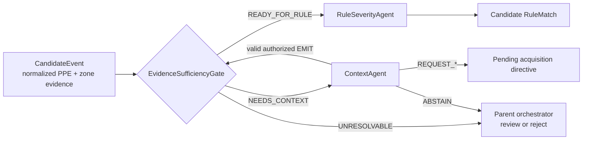

# Controlled Mixture-of-Agents System for Smart Construction Safety Monitoring and Reporting

[](https://github.com/LeeVuKhang/smart-construction-safety-moa/actions/workflows/ci.yml)

A focused Python research prototype for evidence-gated Context and Rule/Severity agents
in a smart-construction safety pipeline.

## Current public scope

This initial public repository contains only the components needed to define and verify
the boundary between:

- a deterministic evidence-sufficiency gate;
- a conditional, provider-neutral Context Agent;
- an optional local `llama.cpp` multimodal adapter;
- a fail-closed Rule/Severity Agent; and
- the typed contracts shared by those components.

Detection, person-PPE association, zone grounding, final orchestration, reporting,
benchmark datasets, model weights, and field deployment are intentionally outside this
initial release.

## Controlled flow



Only `READY_FOR_RULE` may reach the Rule/Severity Agent. Context output is treated as
untrusted until its action, evidence labels, IDs, references, confidence, and capability
authorization pass deterministic validation.

## Agent boundaries

### Context Agent

`ContextAgent` receives a typed `ContextRequest` only after the gate identifies
recoverable ambiguity. It may return exactly one bounded action:

- `EMIT_CONTEXT_EVIDENCE`
- `REQUEST_HIGHER_RESOLUTION_CROP`
- `REQUEST_MORE_FRAMES`
- `ABSTAIN`

It cannot rewrite PPE state, zone grounding, target identity, upstream confidence,
violation, severity, alert policy, or report content. The default adapter is deliberately
unconfigured and fails closed.

### Rule/Severity Agent

`RuleSeverityAgent` consumes one gate-ready `CandidateEvent` and maps only normalized
PPE/zone evidence plus valid confirmed Context evidence to a configured rule. It returns
a candidate `RuleMatch`; it does not make the final alert, review, or reporting decision.
Missing rule configuration, unsupported zones, invalid references, and non-ready routes
raise typed fail-closed errors instead of producing a placeholder match.

## Repository layout

```text
.
├── config/
│   └── rules.json
├── docs/
│   └── PROJECT_CONTEXT.md
├── src/construction_safety_moa/
│   ├── contracts.py
│   ├── context/
│   │   ├── agent.py
│   │   ├── llama_cpp_adapter.py
│   │   ├── media.py
│   │   └── prompt.txt
│   ├── routing/
│   │   └── evidence_gate.py
│   └── rules/
│       └── severity_agent.py
└── tests/
```

## Requirements

- Python 3.10 or newer
- Pillow only for the optional local-media Context path
- A loopback `llama-server` only when exercising the optional local adapter

No cloud model API is required by the core package.

## Install

```powershell
python -m venv .venv
.\.venv\Scripts\Activate.ps1
python -m pip install -e ".[context-pilot,dev]"
```

## Verify

```powershell
python -m ruff check .
python -m unittest discover -s tests -v
```

## Optional local Context adapter

`LlamaCppContextModelAdapter` accepts only loopback endpoints and performs one
OpenAI-compatible multimodal call per Context attempt. It resolves only
manifest-authorized media, checks path containment, MIME type, checksum, image validity,
bounds, and zone geometry, then returns an untrusted `ContextProposal` for normal
`ContextAgent` validation.

The repository does not download or distribute model weights, runtime binaries, or
private media. A local VLM candidate may be configured for research, but candidate
selection is not benchmark validation or field-readiness evidence.

## Implemented, selected, and not yet validated

| Status | Meaning |
| --- | --- |
| Implemented | Typed contracts, deterministic gate, Context validation, manifest-bound media resolution, loopback local adapter, Rule/Severity mapping, and automated tests |
| Selected candidate | A local multimodal model may be chosen for a pilot configuration |
| Not validated here | Real licensed held-out evaluation, field accuracy, production latency, deployment reliability, and end-to-end construction-site operation |

## Safety and research limitations

- This is an alpha research prototype, not a certified safety system.
- It starts from normalized evidence; it does not detect people or PPE.
- It does not automatically fulfill crop or neighboring-frame requests.
- It does not allow a VLM to decide violations, severity, alerts, or reports.
- A logical frame or crop reference is not proof that pixel evidence was acquired.
- Human review and final decision policy belong to a parent orchestrator not included in
  this initial repository.

See [Project Context](docs/PROJECT_CONTEXT.md) for the canonical scope and ownership
rules used by this repository.
